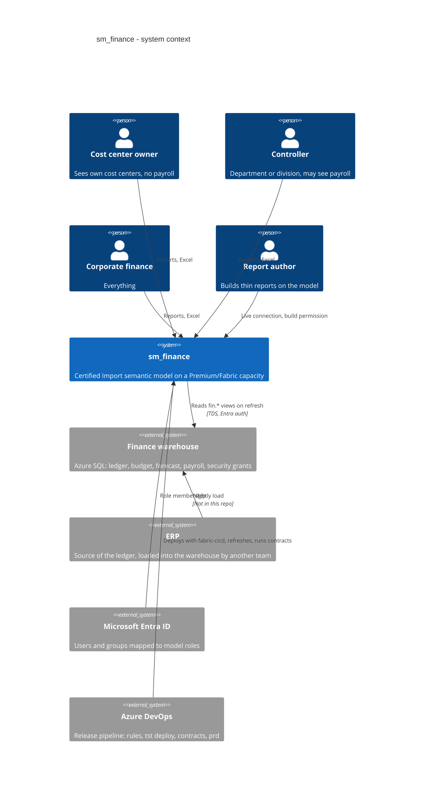

# System context

```mermaid
C4Context
    title sm_finance - system context

    Person(owner, "Cost center owner", "Sees own cost centers, no payroll")
    Person(controller, "Controller", "Department or division, may see payroll")
    Person(cfo, "Corporate finance", "Everything")
    Person(author, "Report author", "Builds thin reports on the model")

    System(model, "sm_finance", "Certified Import semantic model on a Premium/Fabric capacity")

    System_Ext(dw, "Finance warehouse", "Azure SQL: ledger, budget, forecast, payroll, security grants")
    System_Ext(erp, "ERP", "Source of the ledger, loaded into the warehouse by another team")
    System_Ext(entra, "Microsoft Entra ID", "Users and groups mapped to model roles")
    System_Ext(devops, "Azure DevOps", "Release pipeline: rules, tst deploy, contracts, prd")

    Rel(erp, dw, "Nightly load", "Not in this repo")
    Rel(model, dw, "Reads fin.* views on refresh", "TDS, Entra auth")
    Rel(owner, model, "Reports, Excel")
    Rel(controller, model, "Reports, Excel")
    Rel(cfo, model, "Reports, Excel")
    Rel(author, model, "Live connection, build permission")
    Rel(entra, model, "Role membership")
    Rel(devops, model, "Deploys with fabric-cicd, refreshes, runs contracts")
```

Out of scope: loading the warehouse from the ERP, the report files themselves,
and the planning tool that produces budget and forecast.
